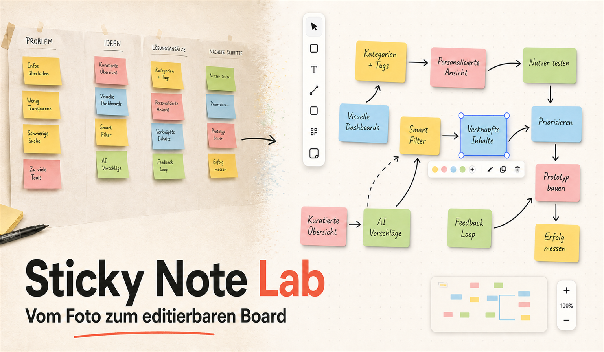

# Sticky Note Lab

Sticky Note Lab verwandelt ein Foto eines Haftnotiz-Boards in ein editierbares digitales Board. Die Verarbeitung läuft lokal im Browser: Notizen werden erkannt, perspektivisch vermessen, per OCR gelesen und anschließend als verschiebbare Objekte dargestellt.



## Funktionen

- farb- und kantenbasierte Erkennung von Haftnotizen
- Rekonstruktion teilweise überlappter und gedrehter Notizen
- perspektivisch entzerrte Mehrfach-OCR mit PaddleOCR, DE·HTR und Tesseract
- Erkennung einfacher Symbole wie Herz, Pfeile, Ausrufezeichen und Smileys
- editierbare Texte, Farben, Größen und Positionen
- Ansicht **Wie im Foto** mit Drehung und Überlappung
- Ansicht **Sortiert** mit geraden, kollisionsfreien Notizen
- Verbindungen zwischen Notizen und Export als JSON, PNG, bearbeitbare PowerPoint (`.pptx`), Excel (`.xlsx`) oder CSV
- keine Übertragung des Board-Fotos an einen Server

## Exportformate

- **JSON** erhält den vollständigen editierbaren Boardzustand einschließlich Geometrie, Layoutmodus und Verbindungen.
- **PNG** erzeugt eine flache Bildversion des aktuellen Boards.
- **PowerPoint (`.pptx`)** überträgt Notizen und Verbindungen als weiterhin bearbeitbare PowerPoint-Objekte.
- **Excel (`.xlsx`) und CSV** enthalten Post-it-Nummer, erkannte Reihe/Zeile und Spalte, Farbbezeichnung, exakten HEX-Farbwert sowie den Text. Wenn die räumliche Anordnung kein belastbares Raster erkennen lässt, bleiben Reihe und Spalte leer.

## Technisch passiert dabei Folgendes

- Das Foto wird vollständig lokal im Browser dekodiert – es wird nirgendwo hochgeladen.
- Farben werden im wahrnehmungsnahen Lab-Farbraum gruppiert. Zusätzlich werden Kanten, Rechtecke und sichtbare Papierfragmente untersucht.
- Bei Überlappungen versucht die Geometrie, verdeckte Ecken zu ergänzen und zu bestimmen, welcher Zettel vorne liegt.
- Aus den vier erkannten Ecken wird per perspektivischer Transformation ein gerader Ausschnitt berechnet – ähnlich wie bei einem Dokumentenscanner.
- Von jedem Ausschnitt entstehen mehrere Varianten: Farbe, Graustufen, Schattenausgleich, Kontrastverstärkung, Sauvola-Schwarzweiß und eine „nur Tinte“-Maske.
- Textzeilen werden einzeln gesucht und zusätzlich als komplette Notiz gelesen.
- Drei unterschiedliche Leser arbeiten zusammen:
  - PaddleOCR als Hauptleser
  - DE·HTR speziell für Handschrift
  - Tesseract als unabhängiger Fallback
- Die Ergebnisse werden nicht einfach blind übernommen. Die Anwendung vergleicht vollständige Texte, einzelne Zeilen, Filtervarianten und unabhängige OCR-Engines. Erst danach wird ein Ergebnis ausgewählt.
- Wörterbücher dürfen nur relativ sichere Tipp- und OCR-Fehler korrigieren, statt beliebige Wörter zu erfinden.
- Herzen, Pfeile, Smileys und Ausrufezeichen laufen über eine separate Formanalyse, weil normale OCR solche Zeichnungen oft als `11`, `V` oder Buchstaben interpretiert.
- Am Ende werden Position, Größe, Drehung, Farbe, Ebenenreihenfolge und Text in React-Zustand überführt. Dadurch ist jede Notiz verschiebbar und editierbar.
- Die sortierte Ansicht berechnet zusätzlich ein kollisionsfreies Raster, ohne die ursprüngliche Fotoanordnung zu zerstören.

Der langsame erste Durchlauf kommt hauptsächlich daher, dass etwa **192 MB lokale OCR-Modelle** geladen, entpackt und für WebAssembly beziehungsweise ONNX vorbereitet werden. Danach laufen die Berechnungen direkt auf deinem Gerät.

Sticky Note Lab kombiniert Computer Vision, mehrere neuronale OCR-Modelle, klassische Bildverarbeitung, geometrische Rekonstruktion und einen grafischen Editor.

## Voraussetzungen

- Node.js `>=22.13.0`
- [pnpm](https://pnpm.io/)
- [Git LFS](https://git-lfs.com/) für die lokalen OCR-Modelle

## Installation

```bash
git lfs install
pnpm install
pnpm dev
```

Die Entwicklungsseite läuft anschließend auf der vom Terminal ausgegebenen lokalen Adresse.

## Im lokalen Netzwerk starten

```bash
pnpm build
pnpm start --host 0.0.0.0 --port 3003
```

Andere Geräte im selben WLAN öffnen danach `http://<IP-des-Rechners>:3003`. Falls die Verbindung blockiert wird, muss Node.js für private Netzwerke in der lokalen Firewall freigegeben sein.

## Qualitätssicherung

```bash
pnpm test
pnpm run lint
```

Die Tests prüfen unter anderem perspektivische Geometrie, überlappende Notizen, OCR-Fusion, Textkorrektur, Symbolerkennung, Modell-Assets und den Produktions-Build. Das Repository enthält bewusst keine fremden Board-Fotos; Bildtests verwenden ausschließlich synthetische Testdaten.

## Projektstruktur

- `app/` – Oberfläche sowie Erkennungs-, OCR- und Boardlogik
- `public/ocr-models/` – lokale OCR-Modelle
- `public/onnx*/`, `public/tesseract*/` – lokale Browser-Runtimes
- `tests/` – Unit-, Foto-, Asset- und Rendering-Tests
- `.openai/hosting.json` – optionale Sites-Konfiguration

## Datenschutz und Lizenzhinweise

Fotos bleiben im Browser und werden nicht hochgeladen. Die mitgelieferten Drittanbieter-Modelle, Wörterbücher und OCR-Runtimes behalten ihre jeweiligen Lizenzen; eine Übersicht mit Quellen, Versionen, Prüfsummen und lokalen Lizenzpfaden steht in [`THIRD_PARTY_NOTICES.md`](THIRD_PARTY_NOTICES.md).

Dieses Repository enthält derzeit keine allgemeine Open-Source-Lizenz und ist als privates Experiment gedacht.

## Alternative: selbst vibe-coden

Wer das Experiment nicht klonen, sondern als eigene Lernübung vollständig neu entwickeln möchte, kann den folgenden Master-Prompt in ein agentisches Coding-LLM wie Codex kopieren. Am besten funktioniert er in einem leeren Repository mit Schreibzugriff, Terminal, Browser und der Möglichkeit, lokale Tests auszuführen.

<details>
<summary><strong>Ausführlichen Vibe-Coding-Prompt anzeigen</strong></summary>

~~~text
Du agierst als leitender Softwarearchitekt, Computer-Vision-Ingenieur, Machine-Learning-Engineer und Product Designer. Entwickle autonom eine vollständige, lokal lauffähige Webanwendung namens „Sticky Note Lab“. Liefere nicht lediglich einen Architekturvorschlag oder isolierte Codefragmente, sondern implementiere, integriere, teste und dokumentiere das gesamte System bis zu einem belastbaren, benutzbaren Zustand.

ZIELBILD

Die Anwendung soll ein Foto eines physischen Haftnotiz-Boards in ein editierbares digitales Board überführen. Aus dem Bild sind für jede sichtbare oder teilweise verdeckte Haftnotiz mindestens Text, Farbe, Position, Größe, Rotation und Ebenenreihenfolge zu rekonstruieren. Die digitale Repräsentation muss anschließend interaktiv bearbeitbar sein: Texte ändern, Notizen verschieben, skalieren, umfärben, löschen, ergänzen und durch gerichtete Verbindungen verknüpfen. Biete zwei verlustfrei umschaltbare Darstellungen an:

1. „Wie im Foto“: ursprüngliche Positionen, Proportionen, Rotationen, Überlappungen und z-Reihenfolge erhalten.
2. „Sortiert“: alle Notizen aufrichten und in einem kollisionsfreien, responsiven Raster anordnen, ohne die Originalgeometrie zu überschreiben.

Die komplette Bildanalyse und Texterkennung muss lokal im Browser erfolgen. Das hochgeladene Foto darf weder an einen Server noch an einen externen OCR-, Analyse-, Telemetrie- oder Modell-Endpunkt übertragen werden. Nach dem Laden der Anwendung sollen sämtliche OCR-Modelle, Wörterbücher, WASM-Runtimes und Worker vom gleichen Origin bezogen werden; verwende keine Laufzeitabhängigkeit von öffentlichen CDNs.

TECHNOLOGISCHER RAHMEN

- Implementiere die Anwendung mit TypeScript, React und einer Vite-kompatiblen Full-Stack-Struktur; Vinext oder eine vergleichbare React-Server-Architektur ist zulässig.
- Verwende pnpm als Paketmanager und Node.js ab Version 22.13.
- Halte sämtliche Browserzugriffe strikt in Client-Komponenten. Der Produktions-Build und das serverseitige Rendering dürfen niemals wegen `window is not defined`, `document is not defined`, `Worker is not defined` oder nicht auflösbarer `file://`-Worker-URLs scheitern.
- Kapsele rechenintensive Inferenz in Web Worker. Nutze Transferables, wo dies unnötige Speicherkopien verhindert, und terminiere Worker, Timer, Object-URLs, Canvas-Referenzen und Modell-Sessions deterministisch.
- Verwende ONNX Runtime Web mit WebGPU als optionale Beschleunigung, sofern stabil verfügbar, und WASM als verlässlichen Fallback. Die Kernfunktionalität darf nicht von WebGPU abhängen.
- Verwende normalisierte Boardkoordinaten in Prozent, damit erkannte Geometrien unabhängig von Bildschirmgröße und Zoom bleiben.
- Trenne Domänenlogik, Bildvorverarbeitung, OCR-Orchestrierung, Textfusion, Symbolerkennung, Boardlayout und UI-Zustand in testbare Module.
- Halte Abhängigkeiten versioniert und reproduzierbar. Große ONNX-, WASM-, TAR- und Sprachmodelldateien gehören in Git LFS.

VERBINDLICHES DATENMODELL

Definiere mindestens folgende typisierte Strukturen:

- `BoardPoint`: zweidimensionaler Punkt im Quellbild.
- `BoardQuad`: geordnetes Quadrilateral aus vier Ecken in der Reihenfolge oben-links, oben-rechts, unten-rechts, unten-links.
- `Note`: `id`, `x`, `y`, `width`, `height`, `rotation`, `zIndex`, `color`, `text`, `confidence`, `origin`, optional `rawText`, `rawConfidence`, `corrections`, `symbols` und die ursprüngliche Quellgeometrie.
- `Edge`: `id`, `sourceId`, `targetId` und optional Darstellungsparameter.
- `OcrEvidence`: `text`, `confidence`, `engine`, `variant`, `scope`, optional `lineIndex`, `elapsedMs` und geometrische Zeileninformation.
- `OcrRunDiagnostics`: Status, Fehler, Laufzeit und Kandidatenanzahl jedes OCR-Moduls.
- `RecognizedSymbol`: Symbolklasse, Konfidenz und normalisierte Bounding Box.

Verwalte Original- und Sortierlayout so, dass die sortierte Ansicht keine destruktiven Änderungen an den fotografisch rekonstruierten Koordinaten verursacht. Undo und Redo müssen atomare Snapshots von Notizen und Verbindungen verwalten.

BILDDEKODIERUNG UND KOORDINATENSYSTEM

1. Dekodiere das Originalfoto in voller Auflösung und bewahre es als alleinige Quelle für spätere OCR-Crops auf.
2. Erzeuge ausschließlich für die globale Haftnotizerkennung eine speicherschonende Arbeitskopie mit begrenzter Kantenlänge. Speichere die exakten Skalierungsfaktoren zwischen Arbeitskopie und Original.
3. Schneide OCR-Bilder niemals aus einer verkleinerten UI-Vorschau aus. Transformiere jede erkannte Geometrie zurück in das Koordinatensystem des Originalfotos und croppe dort.
4. Berücksichtige EXIF-Orientierung, Hoch- und Querformat, ungewöhnliche Seitenverhältnisse sowie sehr große Smartphonebilder.
5. Verhindere Race Conditions bei schnell aufeinanderfolgenden Uploads über eine monotone Scan-Generation oder ein Abort-Konzept. Ein verspätetes Ergebnis eines älteren Scans darf niemals den aktuellen Boardzustand überschreiben.

HAFTNOTIZERKENNUNG

Implementiere eine hybride, mehrstufige Computer-Vision-Pipeline. Verwende weder starre Beispielkoordinaten noch ausschließlich achsenparallele Rechtecke.

1. Farbraum und Segmentierung
   - Konvertiere RGB zusätzlich in CIELAB, weil euklidische Abstände dort die menschliche Farbwahrnehmung besser approximieren als im RGB-Raum.
   - Gruppiere Bildpixel robust in Farbinseln, beispielsweise durch adaptives Clustering, quantisierte Lab-Bins oder K-Means mit konservativer Clusterzahl.
   - Unterdrücke neutrales Papier, Wand, Schatten und extrem dunkle beziehungsweise extrem helle Hintergrundbereiche anhand von Chroma, Luminanz und Flächenstatistik.
   - Stabilisiere Labels mit Majority-Filter, morphologischem Öffnen und Schließen sowie Connected-Component-Analyse.
   - Schätze die Notizfarbe robust aus Innenpixeln; Rand, Schrift, Glanzlicht und Schatten dürfen den Farbwert nicht dominieren.

2. Kanten- und Linienanalyse
   - Berechne getrennte Helligkeits- und Farbkanten, beispielsweise aus Graustufen/CLAHE/Canny sowie Gradienten der Lab-Kanäle, und fusioniere beide Karten.
   - Detektiere ausreichend lange Liniensegmente. Führe nahezu kollineare Fragmente anhand von Winkelabweichung, senkrechtem Abstand und proportionaler Lückengröße zusammen.
   - Werte kurze handschriftliche Striche gegenüber langen Papierkanten ab. Verwende dafür eine aus dem Bild geschätzte typische Notizseitenlänge statt eines bildspezifischen Pixelwerts.
   - Schätze vollständige Quadrilaterale aus sichtbaren Konturen, Linienpaaren, rechten Winkeln und Farbflächen.

3. Perspektive und Rotation
   - Verwende orientierte Quadrilaterale statt bloßer `minX/minY/maxX/maxY`-Boxen.
   - Ordne die vier Eckpunkte deterministisch und validiere Konvexität, Seitenlängen, Innenwinkel, Fläche sowie plausible Perspektivverzerrung.
   - Ermittle die Rotation aus der oberen beziehungsweise robust gemittelten horizontalen Kante und nicht aus handschriftlich kontaminierten Innenkanten.
   - Lerne typische Breite, Höhe und Seitenverhältnisse robust über Median und Median Absolute Deviation aus den sicheren Kandidaten. Erlaube trotzdem unterschiedliche Notizformate.

4. Rekonstruktion von Überlappungen
   - Behandle L-, T- und U-förmige sichtbare Farbkomponenten nicht automatisch als vollständige Notizen.
   - Rekonstruiere verdeckte Rechtecke aus drei sichtbaren Seiten oder zwei benachbarten Seiten, wenn Seitenlängenprior, Farbkonsistenz, Eckenevidenz und Kantenfortsetzung dies stützen.
   - Ergänze Kandidaten aus nur zwei parallelen Seiten ausschließlich bei zusätzlicher unabhängiger Evidenz. Erzeuge aus einer einzelnen Linie niemals eine Haftnotiz.
   - Analysiere T-Junctions: Die durchgehende Kontur gehört typischerweise zum vorderen Objekt, während die terminierende Kontur auf ein verdecktes hinteres Objekt hinweist.
   - Baue aus diesen Relationen einen gerichteten Occlusion-Graphen und leite per topologischer Sortierung eine robuste `zIndex`-Reihenfolge ab. Löse widersprüchliche schwache Kanten konservativ auf und markiere Unsicherheit, statt eine willkürliche Reihenfolge zu erfinden.
   - Behalte stark überlappende Kandidaten, wenn unterschiedliche Farben, sichtbare Kanten oder T-Junctions zwei reale Objekte belegen. Klassisches Non-Maximum-Suppression ist hier ungeeignet.
   - Führe Kandidaten nur dann als Duplikate zusammen, wenn Polygon-IoU, Mittelpunkt, Winkel, Farbe und verwendete Kantensegmente nahezu identisch sind.

5. Kandidatenbewertung
   - Berechne einen nachvollziehbaren Gesamtscore aus Seitenabdeckung, Eckenevidenz, Farbhomogenität, Innen-Außen-Kontrast, Größenprior, Seitenverhältnis, Textzentren und Occlusion-Evidenz.
   - Bestrafe Geometrien, deren vorgeschlagene Papierkante durch eindeutig sichtbaren Text oder eine homogene Vordergrundnotiz verläuft.
   - Verhindere Riesenboxen, fragmentbedingte Miniboxen und eine Explosion nahezu identischer Rechtecke.
   - Liefere zu jeder erkannten Notiz Diagnoseinformationen über Geometriequelle, Unsicherheit und Rekonstruktionsart.

PERSPEKTIVISCHE ENTZERRUNG UND OCR-VORVERARBEITUNG

Für jede Notiz ist aus dem Originalfoto mittels projektiver Homographie ein entzerrtes, frontoparalleles Rechteck zu erzeugen. Bestimme die Zielauflösung aus den gemittelten gegenüberliegenden Seitenlängen. Vergrößere kleine Crops hochwertig um ungefähr den Faktor zwei bis drei, ohne das Seitenverhältnis zu verändern.

Korrigiere anschließend eine verbleibende leichte Zeilendrehung über Textkanten, Projektionsprofile oder eine robuste Deskew-Schätzung. Erzeuge mindestens folgende tatsächlich aktiv verwendete Varianten:

1. farbkorrigierter RGB-Crop,
2. Graustufenbild mit Schatten- beziehungsweise Hintergrundnormalisierung,
3. lokal kontrastverstärkte Version, beispielsweise CLAHE oder vergleichbar,
4. adaptive Sauvola-Binarisierung,
5. farbhintergrundbereinigte Tintenmaske,
6. bei Bedarf invertierte oder morphologisch stabilisierte Variante.

Ein implementierter Filter, der niemals in die OCR-Kandidaten gelangt, gilt als Fehler. Dokumentiere in Diagnosen, welche Variante von welchem Reader tatsächlich verarbeitet wurde.

Detektiere einzelne Textzeilen mittels horizontaler Projektion, Connected Components und adaptiver Zusammenführung benachbarter Bänder. Erzeuge sowohl komplette Notiz-Crops als auch Zeilen-Crops. Beschneide Zeichenober- und -unterlängen nicht. Ein Zeilen-Crop darf nur seine zugehörige Zeile verbessern und niemals einen vollständigen mehrzeiligen Notiztext als Ganzes verdrängen.

OCR-ENSEMBLE

Integriere drei voneinander unabhängige Leser:

1. PaddleOCR als primäre allgemeine OCR. Verwende eine moderne PP-OCRv6-Konfiguration mit einem kompakten Detektionsmodell und einem qualitativ stärkeren Recognition-Modell. Nutze lokale Modellarchive und initialisiere die Engine fehlertolerant.
2. DE·HTR oder ein vergleichbares lokal ausführbares ONNX-Handschriftmodell als unabhängige Zweitmeinung für handschriftliche Zeilen. Führe CTC-Decoding korrekt aus und behandle Blank-Token, Wiederholungen, Padding und variable Breiten.
3. Tesseract.js als unabhängigen Fallback mit lokalen deutschen und englischen Sprachdaten. Probiere sinnvolle Page-Segmentation-Modi wie `SINGLE_BLOCK`, `SINGLE_LINE` und `SPARSE_TEXT` nur in den jeweils passenden Scopes.

Lade große Modelle lazy und zeige deren Initialisierung ehrlich an. Ein Enginefehler darf die Gesamtanalyse nicht abbrechen, solange mindestens ein Reader weiterarbeiten kann. Kapsle Timeouts, Workerabstürze und partielle Modellfehler. Zeige für Paddle, DE·HTR und Tesseract getrennte Zustände wie bereit, eingeschränkt, fehlgeschlagen oder übersprungen.

EVIDENZFUSION

Implementiere eine explizite Evidenzfusion statt „höchste Konfidenz gewinnt“:

- Normalisiere Whitespace, Zeilenumbrüche und triviale Unicodevarianten, bewahre aber den Rohtext.
- Begrenze repetitive Kandidaten desselben Readers und derselben Zeile, damit zwanzig Filtervarianten eines Modells keine künstliche Mehrheitsentscheidung erzeugen.
- Behandle unterschiedliche Vorverarbeitungen desselben Modells als korrelierte Evidenz, nicht als unabhängige Leser.
- Belohne Übereinstimmung unabhängiger Engines, visuelle Vollständigkeit, stabile Zeilenanzahl und konsistente räumliche Reihenfolge.
- Vergleiche Texte mittels gewichteter Levenshtein-Distanz, wobei typische OCR-Verwechslungen wie `O/0`, `I/l/1`, `S/5`, `B/8`, `rn/m`, `cl/d` oder getrennte beziehungsweise verschmolzene Glyphen geringere Kosten erhalten dürfen.
- Verhindere, dass ein kurzer, hochkonfidenter Teilstring einen plausiblen vollständigen Notiztext ersetzt.
- Erhalte nicht bestätigte Projektbegriffe, Eigennamen, Akronyme, Kennzahlen und Identifikatoren. Erfinde keine semantisch „schöneren“ Inhalte.
- Speichere `rawText`, fusionierten Text, Konfidenz, Korrekturen und die maßgeblichen Evidenzquellen nachvollziehbar.

KONSERVATIVE TEXTKORREKTUR

Verwende lokale deutsche und englische Hunspell-Wörterbücher über eine Bibliothek wie nspell. Die Korrekturstufe darf nur orthografisch beziehungsweise glyphisch begründbare Reparaturen vornehmen.

- Nutze Boardkontext zur Spracherkennung und als schwache Domänenevidenz, nicht als Freibrief zur Textgenerierung.
- Schütze existierende Wörter nicht absolut: Ein reales, aber im Kontext wahrscheinlich falsch erkanntes Wort wie `OLDER` darf zu `ORDER` korrigiert werden, wenn mehrere unabhängige OCR-Lesarten `ORDER` beobachtet haben.
- Korrigiere keine bloß ungewöhnlichen Wörter ohne visuelle oder OCR-seitige Evidenz.
- Verwende keine auf einzelne Demofotos zugeschnittenen Ersetzungslisten, Koordinaten oder Satzschablonen.
- Zeige unsichere Ergebnisse editierbar an und markiere sie zur manuellen Prüfung, statt sie durch Platzhalter wie „Text ergänzen“ massenhaft zu überschreiben.
- Biete für jede korrigierte Notiz die Wiederherstellung des OCR-Originals an.

SYMBOLERKENNUNG

Erkenne einfache handgezeichnete Symbole separat von der Wort-OCR: Herz, Pfeil links/rechts/oben/unten, Ausrufezeichen, lachender Smiley und trauriger Smiley.

- Arbeite auf mindestens zwei unabhängig erzeugten Tintenmasken und fusioniere nur räumlich sowie klassenseitig konsistente Detektionen.
- Nutze Connected Components, Konturen, Löcher, Endpunkte, Verzweigungen, Symmetrie, Kompaktheit, Richtungsvektoren, Pfeilspitzenwinkel, Gesichtskontur, Augenanzahl und Mundkrümmung.
- Ein Herz darf nicht allein deshalb erkannt werden, weil OCR `11` liefert. Umgekehrt darf ein echtes `11` in einem Text nicht gelöscht werden.
- Ersetze eine OCR-Verwechslung wie ausschließlich `11` nur bei hochkonfidenter, dominanter Herzgeometrie; in gemischtem Text hänge das erkannte Symbol separat an.
- Vermeide Fehlklassifikationen von Buchstabenformen wie `I`, `V`, `T`, `Y`, `K`, `O` und `H`.
- Füge erkannte Symbole als normalen editierbaren Unicode-Text ein und biete im Inspektor zusätzlich eine manuelle Symbolpalette.

INTERAKTIVER BOARD-EDITOR

Erstelle eine hochwertige, responsive Arbeitsoberfläche:

- Kopfzeile mit Produktname, aktuellem Dateinamen, Undo, Redo und Export.
- Linke Seitenleiste für Foto-Upload per Klick und Drag-and-drop, Vorschau, Analysefortschritt, Enginezustände, Ebenen und Deckkraft des Originalfotos.
- Zentrale Canvas-Fläche mit Auswahlwerkzeug, Notiz hinzufügen, Verbindungen erzeugen, Foto ein-/ausblenden, Board fokussieren und Zoomsteuerung.
- Rechte Seitenleiste als Inspektor für Text, Symbolpalette, Farbe, Position, Größe, Drehung, Ebenenreihenfolge, OCR-Konfidenz, Rohtext und Wiederherstellung.
- Auf schmalen Displays müssen die Steuerelemente touchfreundlich bleiben; der Boardbereich darf nicht durch Desktop-Seitenleisten unbenutzbar werden.
- Unterstütze Pointer Events für Maus, Stift und Touch. Verhindere versehentliches Scrollen nur während einer aktiven Geste.
- Notizen müssen auswählbar, verschiebbar und skalierbar sein. Bewahre Rotation und z-Reihenfolge im Originalmodus.
- Verbindungen sollen auf Notizzentren beziehungsweise geeignete Randanker reagieren und als gerichtete Kurven mit Pfeilspitzen erscheinen.
- Biete manuelles Hinzufügen und Löschen von Notizen sowie Verbindungen.
- Verwende semantische Controls, sichtbare Fokuszustände, zugängliche Namen, ausreichende Kontraste und Live-Regionen für Analysezustände.

FORTSCHRITT UND FEHLERTRANSPARENZ

Zeige nicht lediglich einen Prozentwert, der scheinbar bei 41 Prozent einfriert. Modellinitialisierung und Inferenz sind nicht immer linear quantifizierbar. Kombiniere deshalb:

- Gesamtfortschritt,
- aktuelle Phase,
- Schritt `n/m`,
- verstrichene Zeit,
- animierten Aktivitätsindikator,
- verständliche Detailmeldung,
- individuellen Zustand jeder OCR-Engine.

Aktualisiere den Aktivitätszustand auch während langer Modellinitialisierung. Behaupte keine präzise Prozentzahl, wenn lediglich ein indeterminierter Arbeitsschritt läuft. Bei Teilfehlern soll das Board mit den verfügbaren Ergebnissen benutzbar bleiben.

LAYOUTALGORITHMEN

„Wie im Foto“ verwendet die aus dem Quellbild normalisierten Geometrien. Berechne CSS-Rechtecke aus dem Mittelpunkt und den gemittelten Quad-Seitenlängen; wende Rotation um das Zentrum an und sortiere nach rekonstruierter Occlusion-Reihenfolge.

„Sortiert“ soll:

- eine stabile Leserichtung aus Originalzentren ableiten,
- eine geeignete Spaltenzahl anhand Boardseitenverhältnis, Notizanzahl und verfügbarer Fläche auswählen,
- Notizen mit einheitlichen Abständen und ohne Kollisionen anordnen,
- Rotation auf null setzen,
- Textgröße nicht unlesbar klein skalieren,
- deterministisch sein und das Eingabearray nicht mutieren.

IMPORT UND EXPORT

- Exportiere ein versioniertes JSON-Format `sticky-note-lab-board`, Version 4, mit Layoutmodus, Boardseitenverhältnis, Notizen und Verbindungen.
- Speichere das Originalfoto aus Datenschutzgründen standardmäßig nicht im JSON.
- Importiere aktuelle Dateien und akzeptiere aus Gründen der Rückwärtskompatibilität optional das Legacy-Format `postit-lab-board`.
- Exportiere das digitale Board als PNG einschließlich Farben, Texte, Rotationen und Verbindungen.
- Bereinige importierte numerische Werte, ergänze fehlende Rotation beziehungsweise z-Reihenfolge und lehne strukturell ungültige Dateien verständlich ab.

PERFORMANCE UND SPEICHERDISZIPLIN

- Nutze die verkleinerte Arbeitskopie nur für globale Detektion; OCR bleibt an Originalpixel gebunden.
- Verarbeite OCR-Aufgaben über eine kontrollierte Queue, damit mobile Browser nicht durch gleichzeitig laufende Modelle und dutzende Canvases abstürzen.
- Cache initialisierte Modelle und wiederverwendbare Ressourcen, nicht jedoch unbegrenzt Bilddaten.
- Gib OpenCV-Matrizen, Tensoren, ImageData, Worker und temporäre Canvases so früh wie möglich frei.
- Vermeide unnötige React-Rerenders während Pointerbewegungen und OCR-Fortschritt.
- Verwende progressive Ergebnisse: Geometrien sollen früh sichtbar werden, während OCR im Hintergrund weiterläuft.
- Sorge dafür, dass ein Scan abgebrochen und durch einen neuen ersetzt werden kann.

DATENSCHUTZ, LIZENZEN UND REPOSITORY-HYGIENE

- Keine Uploads, externen OCR-Aufrufe, Analytik oder Telemetrie.
- Keine geheimen Schlüssel im Client oder Repository.
- Keine fremden Stockfotos oder ungeklärten Testbilder committen. Erzeuge Testbilder synthetisch im Testcode oder nutze ausdrücklich freigegebene eigene Fixtures.
- Dokumentiere alle eingebetteten Modelle, Runtimes, Sprachdaten und Wörterbücher in `THIRD_PARTY_NOTICES.md` mit Komponente, Version, Lizenz, Upstream-Quelle, lokalem Lizenzpfad und SHA-256 für große Modellassets.
- Erhalte alle vorgeschriebenen Copyright-, NOTICE- und Lizenztexte.
- Lege eine `.gitattributes` für große Binärassets und eine sinnvolle `.gitignore` an.
- Verwende den neutralen Produktnamen „Sticky Note Lab“ und keine fremde Produktmarke als eigenen Projektnamen.

TESTSTRATEGIE

Implementiere automatisierte Tests auf mehreren Ebenen:

1. Geometrie-Unit-Tests
   - exakte Abbildung eines Quads in normalisierte Boardgeometrie,
   - Rotation und Seitenlänge,
   - deterministisches Sortierlayout ohne Überlappung,
   - z-Reihenfolge unterschiedlich gefärbter überlappender Notizen.

2. Synthetische Computer-Vision-Tests
   - zwei gleichfarbige, gedrehte, teilweise überlappende Rechtecke,
   - unterschiedlich gefärbte Überlappungen,
   - kleine Farbfragmente, die keine Notiz werden dürfen,
   - keine nahezu identischen Duplikatboxen und keine Riesenbox.

3. OCR-Vorverarbeitung und Evidenzfusion
   - Homographie bildet alle vier Ecken korrekt ab,
   - Deskew und Zeilenbanderkennung beschneiden keine Zeichen,
   - alle Filtervarianten werden wirklich ausgeführt,
   - viele Kandidaten derselben Engine simulieren keine unabhängige Mehrheit,
   - ein Zeilen-Crop verdrängt niemals den vollständigen Notiztext,
   - unabhängiger Konsens schlägt einen einzelnen plausiblen Realwortfehler,
   - unbekanntes Projektvokabular bleibt erhalten.

4. Symboltests
   - alle vier Pfeilrichtungen,
   - Herz und gebrochen gezeichnetes Herz,
   - Ausrufezeichen,
   - lachendes und trauriges Gesicht,
   - leichte Rotation,
   - negative Tests für Buchstaben und parallele `11`-Striche.

5. Produktions- und Assettests
   - TypeScript ohne Fehler,
   - Produktions-Build erfolgreich,
   - serverseitiges Rendering ohne Browser-Globals,
   - Worker-URL ist browserkompatibel und enthält kein `file://`,
   - lokale WASM-, Modell- und Sprachassets existieren und sind nicht abgeschnitten,
   - dokumentierte SHA-256-Prüfsummen stimmen,
   - gerenderte Oberfläche enthält Upload, Anordnungsmodi, Editor und Fortschrittsanzeige.

Verwende keine Tests, die lediglich nach Implementierungsstrings suchen, wenn ein Verhalten direkt ausführbar geprüft werden kann. Ergänze String- beziehungsweise Build-Artefaktprüfungen nur dort, wo Browserbundling, Workerpfade oder ausgelieferte Assets abgesichert werden müssen.

NICHTFUNKTIONALE ABNAHMEKRITERIEN

- Ein Foto kann auf Desktop und Mobilgerät ausgewählt oder abgelegt werden.
- Das Bild bleibt lokal; im Netzwerkprotokoll erscheinen keine Foto-Uploads oder externen OCR-Anfragen.
- Erkannte Notizen erscheinen früh mit plausibler Farbe und Geometrie.
- OCR verarbeitet perspektivisch entzerrte Originalpixel und verwendet nachweislich mehrere Vorverarbeitungen.
- Mindestens zwei unabhängige OCR-Systeme können zur Entscheidung beitragen; der Ausfall eines Systems ist nicht fatal.
- Vollständige Notiztexte werden nicht durch einzelne Zeilenfragmente ersetzt.
- Ein gezeichnetes Herz wird nicht pauschal als `11` gespeichert.
- Überlappende Notizen bleiben im Originalmodus überlappend und in plausibler Ebenenreihenfolge.
- Der Sortiermodus enthält keine Kollisionen und verändert nicht die gespeicherte Originalgeometrie.
- Text, Farbe, Position, Größe, Rotation und Verbindungen sind editierbar.
- JSON-Roundtrip erhält den Boardzustand; PNG-Export funktioniert.
- Analysefortschritt zeigt während langer Initialisierung nachweisbar Aktivität.
- Keine ungefangenen Laufzeitfehler, keine SSR-Browserglobalfehler und keine dauerhaft hängenden Worker.
- Alle Tests, Linting, TypeScript-Prüfung und Produktions-Build laufen erfolgreich.

ARBEITSWEISE

1. Inspiziere zuerst das Repository und vorhandene Abhängigkeiten. Bewahre eine funktionierende bestehende Architektur, falls vorhanden.
2. Erstelle eine kurze, ausführbare Implementierungsreihenfolge und beginne sofort mit einem vertikalen funktionsfähigen Schnitt: Upload, ein erkanntes Board, editierbare Notizen.
3. Implementiere anschließend Geometrie, OCR, Fusion, Symbole, Layoutmodi, Export und Diagnostik modular.
4. Verwende keine bildspezifischen Sonderfälle, hart codierten Texte oder Koordinaten. Jede Heuristik muss aus dimensionslosen Relationen, robusten Bildstatistiken oder klar dokumentierter Evidenz folgen.
5. Schreibe Tests parallel zu den Modulen. Führe sie tatsächlich aus und behebe Fehler, statt nur Testdateien zu erzeugen.
6. Prüfe reale Fehlerpfade: fehlendes Modell, langsame Initialisierung, defektes Bild, erneuter Upload während Analyse, leere OCR und partieller Engineausfall.
7. Liefere am Ende eine aufgeräumte, dokumentierte Anwendung inklusive README, Architekturüberblick, lokaler Startanleitung, Datenschutzhinweis, `THIRD_PARTY_NOTICES.md`, Tests und reproduzierbarem Build.
8. Höre nicht bei einem Mockup auf. Die Kernpipeline muss funktional implementiert sein. Wenn ein Modell oder eine Browserfähigkeit technisch nicht verfügbar ist, implementiere einen ehrlichen Fallback, dokumentiere die Einschränkung und lasse den übrigen Workflow benutzbar.

QUALITÄTSANSPRUCH

Behandle das Vorhaben als ernstzunehmendes Computer-Vision-System und nicht als dekorative Demo. Priorisiere nachvollziehbare Evidenz, konservative Rekonstruktion, reproduzierbare Tests, Datenschutz und editierbare Ergebnisse. Die Anwendung soll Unsicherheit sichtbar machen, aber niemals durch semantische Halluzination kaschieren. Das Endergebnis muss technisch kohärent, lokal ausführbar, responsiv, robust gegen Teilfehler und für weitere Experimente gut erweiterbar sein.
~~~

</details>
